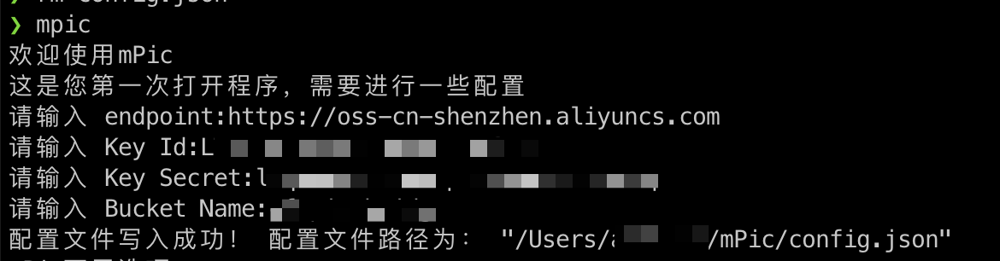

# mPic - **markdown图片上传工具** 

## 概述
**轻量、简单、高效**

支持如下图床：  
- `阿里云 OSS` v1.6.0


特点：

* 使用C++编写 运行速度快
* 纯命令行程序，平时不占用资源
* 就一个程序文件，复制到$PATH目录即可


## 使用方法

第一步： 将release的mPic复制到$PATH目录下。（建议复制到/usr/local/bin等）     

第二步： 运行mPic，按照提示进行OSS配置。    



第三步:   按照下图配置Typora。图中标号为4的文本框中输入： "/usr/local/bin/mPic" -r -f


第四步： 尽情使用吧！

## 开发者指南

### 下载源码
```shell
git clone https://github.com/chen-ace/mPic.git
cd mPic
git submodule init
```

### 安装依赖
#### macos
```shell
brew install openssl curl boost
```
#### RedHat
```shell
yum install git cmake make llvm clang openssl-devel boost-devel libcurl-devel zlib-devel
```
### 编译

```shell
mkdir build
cd build
cmake .. -DOPENSSL_ROOT_DIR=/opt/homebrew/Cellar/openssl@1.1/1.1.1s
make
make install
```

